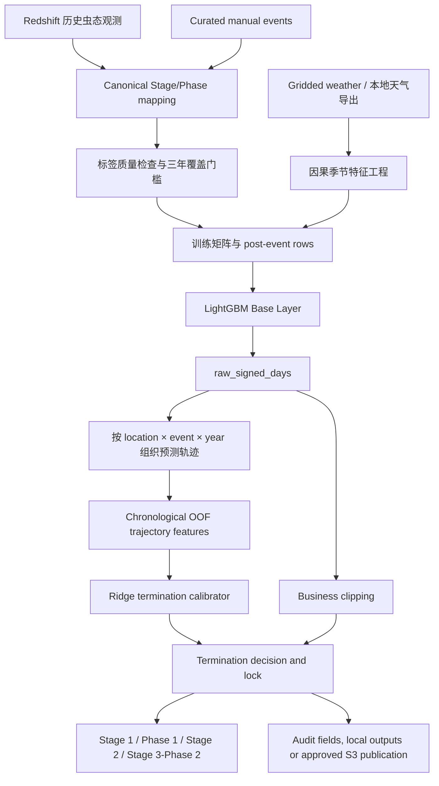

# WeevilTrak v2.4 Forecasting Research

WeevilTrak v2.4 是一个面向 Annual Bluegrass Weevil（ABW，一年生早熟禾象甲）生命周期时序预测的研究与工程化项目。系统利用历史虫态观测、网格化天气、地理位置和季节进程特征，预测指定地点距离关键生命周期事件还有多少天，并将结果转换为可审计的业务事件日期。

本仓库的重点不是重新定义 ABW 生物学，而是研究如何让预测系统在“事件即将发生或已经发生”的边界附近表现得更稳定。v2.4 在 LightGBM 基础预测器之上增加了一个基于历史预测轨迹的 Ridge termination calibration layer，用于判断某个 Stage/Phase 是否应被视为已经到达。

> **研究边界**：模型输出是基于历史观测与天气特征的决策支持信息，不替代现场调查、虫害监测或专业农艺判断。仓库中的白皮书指标来自指定历史窗口和评估口径，不应直接解释为未来生产表现保证。

## 项目意义

传统的“剩余天数”回归模型可能在事件边界附近出现两个业务问题：

- **Post-event positive prediction**：实际事件已经发生，但模型仍报告“还有若干天”。
- **Bounce-up**：预测值接近零后再次升高，使业务信号在事件附近来回波动。

这类误差的数值可能不大，但业务语义可能相反：`3 days remaining` 表示事件仍在未来，而现场观测可能已经确认事件发生。v2.4 因此将问题拆成两个相互独立、可以分别验证的任务：

1. **生物时序预测**：LightGBM 估计距离事件的 signed days。
2. **事件边界校准**：Ridge 模型根据截至当前日期可见的预测轨迹，判断是否应终止并锁定业务输出。

这种分层设计保留了基础模型的预测能力，同时使 termination 决策更容易审计、回滚和单独监控。

## 我的贡献

本仓库提交记录、v2.4 白皮书和实现文件能够核验的个人贡献主要集中在以下方面：

- **v2.4 问题定义与模型设计**：围绕 post-event positive prediction、bounce-up 和事件边界不稳定问题，将 v2.4 设计为“LightGBM 基础预测 + Ridge termination 校准”的两层结构。
- **因果 termination 特征与决策逻辑**：组织当前信号、1–3 日滞后、短期斜率、滚动统计、线性/样条 crossing estimate、位置、Stage 和 day-of-year 等特征，并确保每个预测日只使用当日及以前的信息。
- **防止验证泄漏**：建立按年份推进的 walk-forward / chronological out-of-fold 训练方式，使 termination calibrator 的训练轨迹来自未参与对应 Base 模型训练的历史年度预测，而不是 in-sample prediction。
- **研究验证与技术写作**：完成或整理 v2.3–v2.4 对比、Stage/年份/纬度分层检查、termination policy 对比、特征消融与 Stage-to-Phase 分析，并形成 `WeevilTrak_v2.4_Whitepaper_Academic_Formatted.docx`。
- **数据语义与可审计性工程**：将不稳定的原始 Stage/Phase 含义整理为 canonical business outputs，保留 Base prediction、termination decision、阈值和决策日期等诊断字段，支持回归分析与模型回滚。
- **本地可复现工程**：审查原 AWS/EC2 代码、数据目录和依赖，建立 `weeviltrak-v2.4-local/`；新增相对路径配置、无密钥 `.env.example`、本地 train/predict/walk-forward CLI、fail-closed 私有依赖兼容层、单元测试、输入哈希和运行文档。

上述贡献是在既有 WeevilTrak 数据采集体系和 v2.3 LightGBM Base Layer 基础上完成的。本 README 不将历史观测采集、原始业务系统、团队提供的数据或既有基础模型表述为个人独立成果。

## 当前 v2.4 业务输出

当前代码以 canonical event contract 为准，而不是直接使用 2026 转换前后的原始 `stage_id`：

| Canonical ID | 业务输出 | 训练标签规则 |
| ---: | --- | --- |
| `1` | Stage 1 | 合格的 observed Stage 1 |
| `4` | Phase 1 | 同地点同年度 Stage 1/2 中点，以及符合质量要求的受控 Phase 1 观测 |
| `2` | Stage 2 | 合格的 observed Stage 2 |
| `3` | Stage 3 / Phase 2 | observed Stage 3 或 Phase 2 |

白皮书第 10 节记录了较早的 Phase 1 派生方案比较；当前仓库已经演进为**直接预测 Phase 1**。Phase 1 标签仍可由观测到的 Stage 1/2 中点构造，但不会根据 observed Phase 1 反向伪造 Stage 1 或 Stage 2。

## 系统架构



### 1. 数据与标签层

生产数据来自 Redshift 中的历史 pest-event 记录，并在运行时加入经过筛选的 manual events。进入模型前必须执行 canonicalization：

- 排除 `12/31` 等 placeholder dates；
- 统一 2026 Stage/Phase 转换前后的业务含义；
- 为 Phase 1 构造符合规则的直接训练标签；
- 按训练 cutoff 过滤未来事件，避免 backtest 看到未来 manual labels；
- 对最近三年内四类直接标签执行最小事件数和最小年度覆盖检查。

覆盖门槛不足时，v2.4 的策略是阻止替换模型 artifact，而不是临时降低数据要求。

### 2. 天气与特征工程层

天气特征从每个 pest year 的 3 月 1 日开始累计。滚动特征只使用当前日期及以前的数据，默认窗口为 14 天。

| 特征组 | v2.4 特征 | 作用 |
| --- | --- | --- |
| Lifecycle context | `stage_id` | 区分不同 Stage/Phase 的时序模式 |
| Heat accumulation | `cumu_gdd_air`, `rolling_gdd_air` | 表示季节累计与近期热量条件 |
| Cold accumulation | `cumu_cdd_air`, `rolling_cdd_air` | 表示累计与近期冷胁迫 |
| Moisture context | `rolling_humidity_mean_pct`, `cumu_precip_total_mm` | 表示近期湿度和季节累计降水 |
| Seasonal context | `doy` | 表示预测日在年度中的位置 |
| Spatial context | `latitude`, `longitude` | 表示区域气候与空间差异 |

`cumu_gdd_air` 使用单调递减约束：在其他输入相同的情况下，累计热量增加不应使预测的剩余天数增加。

### 3. LightGBM Base Layer

基础模型预测：

```text
signed_days_to_event = observed_event_date - prediction_date
```

- 正值：事件预计仍在未来；
- 接近零：预测轨迹接近事件边界；
- 负值：事件日期已经过去。

业务层首先执行 clipping：

```text
base_predicted_days = max(raw_signed_days, 0)
```

训练数据同时保留事件后的真实天气行，v2.4 默认加入 10 个 post-event days，使基础模型能够学习事件之后的 signed signal，而不是把所有事件后状态折叠成同一个非负零值。

### 4. Learned Ridge Termination Layer

termination 模型是带 L2 正则化的 Ridge regression。它不直接读取原始天气，而是读取 Base prediction 的可见历史：

- `raw_signed_days`、`predicted_days` 和 termination signal；
- 1–3 个预测点的 lag；
- 一阶到三阶局部 slope；
- 最近窗口的 mean、standard deviation、minimum 和 maximum；
- 对 `0` 与 `-0.5` 阈值的 rolling linear/spline crossing estimate；
- Stage、latitude、longitude 和 prediction day-of-year。

当前主要配置为：

| 参数 | 值 |
| --- | ---: |
| Ridge `alpha` | `30.0` |
| Termination threshold | `4.5` days |
| Minimum visible history | `7` days |
| Training source | Chronological OOF trajectories |
| Business overwrite | Enabled |

前七个可见预测日继续使用 Base output；从第八个可见日开始，termination 可以接管业务输出。一旦触发，后续轨迹保持锁定，避免再次 bounce-up。

### 5. 可审计输出

最终输出不仅包含业务预测，也保留两层模型的决策证据：

| 字段 | 含义 |
| --- | --- |
| `raw_signed_days` | LightGBM 的直接 signed output |
| `base_predicted_days` | termination 覆盖前的非负 Base 结果 |
| `base_predicted_stage_date` | Base Layer 推算的事件日期 |
| `learned_days_remaining` | Ridge calibrator 的连续输出 |
| `termination_threshold` | 当前触发阈值 |
| `termination_reached` | 是否已触发 termination |
| `termination_decision_date` | 首次将事件视为 reached 的日期 |
| `predicted_days` | 最终业务剩余天数 |
| `predicted_stage_date` | 最终业务事件日期 |

## 训练与研究验证

### Walk-forward 设计

对验证年度 `Y`：

1. Base Layer 只能使用 `Y` 年之前且符合训练窗口的数据；
2. 在 `Y` 年生成逐日 Base prediction trajectories；
3. termination 模型只能使用更早 validation years 的 OOF trajectories；
4. 将预测事件日期与 `Y` 年 observed event 比较。

这一设计比随机切分更接近真实年度部署，重点防止未来年度或同一训练样本的预测泄漏到 termination calibrator。

### 评估指标

- Stage-date MAE、RMSE、P90 absolute error；
- within 3 days / within 5 days 等实用窗口准确率；
- post-event positive rate；
- termination reached trajectory rate；
- termination decision MAE / RMSE；
- Stage、年度、地点与纬度带分层误差；
- false early termination 和 prediction-DOY drift。

## 白皮书验证快照

以下结果来自白皮书记录的指定历史验证，不是本地 mock 流程结果，也不是未来生产保证。

### 整体 Stage-date 指标

| 指标 | v2.3 | v2.4 | 变化 |
| --- | ---: | ---: | ---: |
| MAE | 8.35 days | 4.73 days | -3.62 days |
| RMSE | 12.00 days | 6.67 days | -5.33 days |
| P90 absolute error | 19.00 days | 10.00 days | -9.00 days |
| Within 3 days | 21.1% | 49.7% | +28.6 pp |
| Within 5 days | 48.6% | 69.2% | +20.6 pp |
| Post-event positive rate | 1.48% | 1.62% | +0.14 pp |
| Reached trajectory rate | 97.8% | 98.7% | +0.9 pp |

结果显示该验证快照中的日期误差和近日期准确率明显改善；但 post-event positive rate 从 1.48% 小幅上升到 1.62%，因此不能宣称 v2.4 在所有 termination 相关指标上都更优，该指标仍需持续监控。

### 公平 termination policy 对比

白皮书在 2023–2025 窗口比较了 228 条 matched trajectories；其中 223 条轨迹的两种方法都达到 termination：

| 指标 | v2.3 zero-threshold rule | v2.4 learned Ridge |
| --- | ---: | ---: |
| Reached trajectory rate | 97.8% | 98.7% |
| Decision MAE | 6.43 days | 4.48 days |
| Decision RMSE | 9.59 days | 6.51 days |

这些指标评估的是“模型在哪一天宣布事件已到达”，而不是每个逐日预测点的普通回归误差。

## 仓库结构

```text
.
├── README.md
├── WeevilTrak_v2.4_Whitepaper_Academic_Formatted.docx
├── weeviltrak/                    # 原始研究/生产代码快照，本地复刻时保持不变
└── weeviltrak-v2.4-local/         # 可在本地复现和验证的 v2.4 工程
    ├── app/
    │   ├── config/                # v2.1-v2.5 与 v2.4-local 配置
    │   ├── local/                 # 本地 train/predict/walk-forward CLI
    │   ├── models/                # LightGBM / Random Forest managers
    │   ├── pipeline/              # 生产、backtest、hindcast、evaluation、termination
    │   └── services/              # 数据、天气、canonical events、coverage gate
    ├── docs/                      # 架构、数据风险、运行手册与本地审查
    ├── manual/                    # 客户端本地 pickle inference contract
    ├── scripts/                   # backtesting、validation、weather、release 工具
    ├── tests/                     # 本地化单元测试
    ├── vendor/griddedweather/     # fail-closed 离线兼容层
    ├── .env.example
    └── requirements-local.txt
```

## 技术栈

| 层 | 技术 |
| --- | --- |
| Language/runtime | Python 3.11+；项目研究合同以 Python 3.11 为基准 |
| Data processing | pandas、NumPy、PyArrow |
| Base model | LightGBM `LGBMRegressor` |
| Termination model | scikit-learn Ridge、Pipeline、ColumnTransformer、StandardScaler、OneHotEncoder |
| Numerical methods | SciPy spline crossing、scikit-learn metrics |
| Spatial processing | GeoPandas、Shapely |
| Production data | Amazon Redshift、S3、boto3、private `griddedweather` |
| Configuration | YAML、environment variables、python-dotenv |
| Research/visualization | Jupyter、Matplotlib、Plotly、SHAP |
| Testing/quality | unittest/pytest、Black、isort、flake8、mypy |
| Environment | Poetry（生产依赖审计）与 pinned local requirements |

## 本地快速开始

本地工作流不会连接 Redshift 或 S3。以下命令需要在仓库根目录执行：

```powershell
cd weeviltrak-v2.4-local

python -m venv .venv
.venv\Scripts\Activate.ps1
python -m pip install --upgrade pip
python -m pip install -r requirements-local.txt

python -m unittest discover -s tests/unit -v
python -m app.local.cli prepare-mock
python -m app.local.cli train
python -m app.local.cli predict --date 2026-05-01
python -m app.local.cli walk-forward
```

`prepare-mock` 生成的是确定性的 schema-valid 合成天气，只用于验证代码、依赖、特征和 artifact 流程。不得用 mock 指标评价模型效果或撰写研究结论。

### 本地化验收记录

在合成天气 smoke test 中，本地工程完成了：

- 4 个本地单元测试；
- 23,988 行 Base training matrix；
- 22,692 行 chronological OOF termination trajectories；
- 2026-05-01 的 40 个位置 × 4 个 canonical events，共 160 行预测；
- 覆盖 2025 和 2026 的 walk-forward 流程；
- Base model、termination model、config 和 manifest 的 SHA-256 校验。

这些数字仅表明本地工程路径可以运行，不表示真实天气下的模型精度。

## 真实研究数据要求

真实本地研究需要经过授权的 daily engineered weather CSV 或 Parquet，至少包含：

```text
date, location_id, place_id, latitude, longitude,
cumu_gdd_air, rolling_gdd_air, rolling_humidity_mean_pct,
cumu_precip_total_mm, doy, cumu_cdd_air, rolling_cdd_air
```

特征必须按地点和 pest year 因果计算，不能用未来天气补齐历史行，也不能将缺失工程特征静默替换为零。详细说明见 [本地复现指南](weeviltrak-v2.4-local/docs/LOCAL_REPRODUCTION.md)。

## 生产模式与本地模式

| 能力 | AWS/生产路径 | 本地复现路径 |
| --- | --- | --- |
| Pest events | Redshift | 冻结的 canonical event export |
| Weather | private `griddedweather` + Redshift/S3 cache | 授权的 engineered feature 文件或显式 mock |
| Spatial coverage | S3 coverage object | feature 文件中的 `place_id` 和坐标 |
| Model storage | S3 object keys | `outputs/local/artifacts/` |
| Prediction output | S3 versioned prefix | `outputs/local/` |
| Credentials | AWS/Redshift environment | 不需要 |

本地兼容层对 live weather query 采取 fail-closed 策略：没有授权依赖时会明确报错，而不是生成看似真实的天气数据。

## 环境变量与敏感信息

本地运行只需要相对路径配置。生产连接可能读取：

```text
S3_BUCKET_NAME
AWS_PROFILE
AWS_REGION
REDSHIFT_HOST
REDSHIFT_PORT
REDSHIFT_USER
REDSHIFT_PASSWORD
REDSHIFT_DATABASE
DATABASE_HOST
DATABASE_PORT
DATABASE_NAME
```

仓库只提供 [.env.example](weeviltrak-v2.4-local/.env.example)，不应提交 `.env`、AWS credentials、Redshift password、私钥或真实敏感配置。

## 数据质量、限制与开放风险

- 历史 Excel 与 Redshift 不是严格一一对应；2020、2023 和 2024 数据批次存在已确认的日期交换风险。
- `12/31` 记录通常是 placeholder，不应作为 observed event label。
- 2026 Stage/Phase 转换改变了原始 ID 的含义，必须经过 canonical mapping。
- 三年窗口可能无法为每个 canonical event 提供足够直接标签；coverage gate 可以合法地阻止 retraining。
- 天气覆盖、空间映射和 cache 完整性会直接影响训练与预测结论。
- 白皮书中的消融结果提示 lifecycle context 与 thermal accumulation 是主要贡献来源；部分 moisture/spatial features 的边际贡献可能为负，需要在新数据窗口中继续检验，而不是直接删除。
- 本地新训练的 artifacts 是研究候选，不自动等同于批准的生产模型。

## 安全与公开发布

以下内容不得未经授权发布到公共 GitHub：

- `data_exports/`、Redshift snapshots 和带精确坐标/人员信息的事件数据；
- `data/local/`、weather cache、spatial coverage 和预测明细；
- `outputs/`、模型 pickle/joblib、release manifests 和运行日志；
- `.env`、AWS 配置、Redshift credentials、SSH/TLS keys；
- 未清除输出或包含内部数据的 notebooks；
- 私有包源、访问 token 或 proprietary `griddedweather` 包。

详见 [本地复制审查报告](weeviltrak-v2.4-local/docs/LOCAL_AUDIT.md) 和项目内 [.gitignore](weeviltrak-v2.4-local/.gitignore)。

## 进一步阅读

- [v2.4 当前架构](weeviltrak-v2.4-local/docs/architecture/weeviltrak_model_process_overview.md)
- [模型版本说明](weeviltrak-v2.4-local/docs/models/model_versions.md)
- [历史数据合同与风险](weeviltrak-v2.4-local/docs/data/historical_data_contract_and_risks.md)
- [v2.4 训练与发布手册](weeviltrak-v2.4-local/docs/operations/v24_training_release_runbook.md)
- [本地复现指南](weeviltrak-v2.4-local/docs/LOCAL_REPRODUCTION.md)
- [本地审查报告](weeviltrak-v2.4-local/docs/LOCAL_AUDIT.md)
- [v2.4 Academic Whitepaper](WeevilTrak_v2.4_Whitepaper_Academic_Formatted.docx)

## 状态说明

- 当前 canonical default：`v2.4`。
- `v2.5`：deprecated compatibility config，不用于新 artifact。
- 本地工程：`weeviltrak-v2.4-local/`。
- 生产 release：需要批准的数据快照、天气缓存、模型 artifacts、凭证和发布流程。
- 仓库当前未声明开源许可证；在获得数据、模型与代码授权前，不应假定允许公开再分发。
