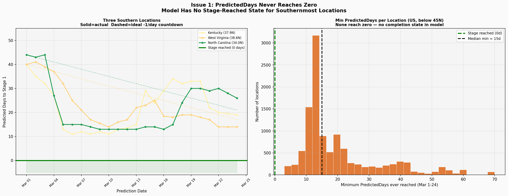
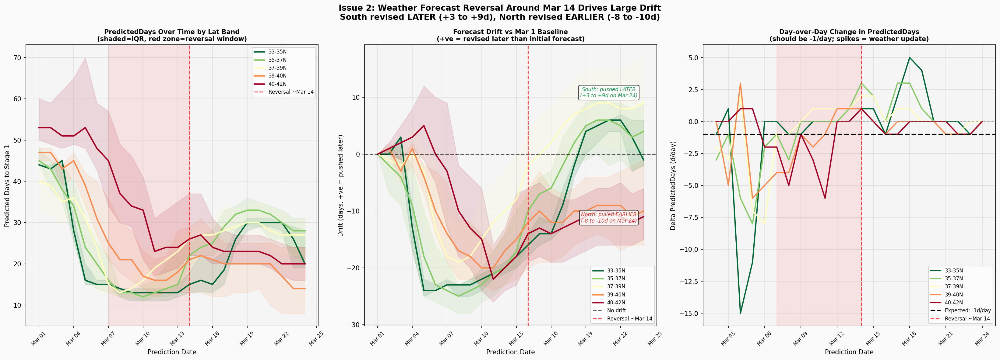
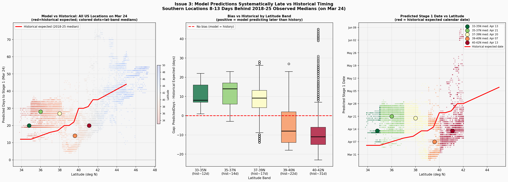

# WeevilTrak 模型预测问题诊断报告（人话版）

**日期：** 2026年4月9日
**数据来源：** `weeviltrak_models_predictions_history`（DEV数据库，预测日期 2026-03-01 至 2026-03-24）
**范围：** 第1阶段（越冬成虫），美国地区
**诊断脚本：** `scripts/stage1_issues_diagnostic.py`
**图表：** `data/plots/`

**相关文件：** `app/services/data_preparation_service.py`、`app/models/model_manager.py`、`app/config/weeviltrak_v2.1.yml`、`app/pipeline/train_predict.py`

---

## 问题1 — 预测天数永远到不了零

### 我们发现了什么

在3月1日到24日期间，所有北纬45度以下的美国地区，第1阶段的预测天数**从来没有降到过零**。模型倒数着倒数着就卡住了，然后开始反弹，就是不肯归零。

- **肯塔基州（~37.9°N）：** 最小预测天数 = 11天（3月6日）
- **西弗吉尼亚州（~38.6°N）：** 最小值 = 9天（3月24日）
- **中位数最小值（45°N以下）：** 15天


*图1：所有美国地区的预测天数时间序列（2026年3月1-24日）。没有任何地区达到零。*

_各地区预测面板未随当前代码仓分发。_
*图1b：各地区预测天数面板。所有轨迹在整个窗口期间保持在零以上。*

### 为什么会这样

两个原因叠加在一起：

1. **训练数据有缺口：** `prepare_training_data()` 用的是前向合并（`direction="forward"`），只把天气数据和**未来**的阶段事件配对。所以训练数据里每一行的`days_to_event`都大于0——模型在训练时从来没见过零长什么样。
2. **没有单调性约束：** 随机森林没办法保证"GDD越多，预测天数越少"。就算加了事件后的数据，随机森林还是可能把预测值弹回去。

换成 LightGBM，加上单调约束（`cumu_gdd_air`设为-1表示递减），就能从结构上防止GDD增加时预测也跟着增加。再配合事件后的训练数据，这个问题就从根本上解决了。

### 怎么修复

**在训练数据里加入"事件已经发生"的数据**

在现有的前向合并之后，再加一个后向合并，把那些阶段事件已经发生的数据抓出来，把`days_to_event`设成0：

```python
# data_preparation_service.py :: prepare_training_data()

# 新增：后向合并获取事件在过去发生的行
post_event = pd.merge_asof(weather_sorted, weevil_sorted,
                           left_index=True, right_on="stage_date",
                           by=["place_id", "stage_id"], direction="backward")
post_event["days_since_event"] = (post_event.index - post_event["stage_date"]).dt.days
post_event = post_event[
    (post_event["days_since_event"] >= 0) &
    (post_event["days_since_event"] <= config.post_event_window_days)  # 比如30天
]
post_event["days_to_event"] = 0

model_data = pd.concat([pre_event, post_event], ignore_index=True)
```

在配置里加上`post_event_window_days: 30`。这样每个地点-年份-阶段就能有约30个"已经完成"的样本。然后LightGBM对`cumu_gdd_air`的单调约束就能确保预测值随着GDD累积只会往零走——不需要单独搞个分类器。

---

## 问题2 — 寒潮一来，预测乱跳

### 我们发现了什么

3月7-14日左右来了一波寒潮，结果预测天数在一周内上下乱跳了15-25天：

1. **3月4-7日（暖和）：** GDD快速累积——南部地区预测每天下降12-15天
2. **3月7-14日（寒潮）：** GDD停滞——预测每天反弹4-5天，把预测日期往后推了15-25天

**3月24日 vs 3月1日的整体偏移：**

| 纬度带 | 净偏移 | 方向 |
|---|:---:|---|
| 33-35°N | +1.6天 | 更晚 |
| 35-37°N | +3.4天 | 更晚 |
| 37-39°N | +8.4天 | **更晚** |
| 39-40°N | -7.8天 | 更早 |
| 40-42°N | -9.7天 | 更早 |


*图2：各纬度带的每日预测天数。先暖后冷的天气导致±15-25天的波动。*

_预测阶段日期漂移图未随当前代码仓分发。_
*图2b：观察窗口期间的预测阶段日期漂移。*

### 为什么会这样

7天的`rolling_gdd_air`窗口太短了，一周的寒冷就能主导整个特征。南部地区接近它们的GDD事件阈值，处于模型响应的陡峭区域——特征稍微一变，输出就大幅波动。随机森林没有梯度正则化，所以寒潮可以把特征推到稀疏区域，那里森林会平均一些不相关的叶子值。而且模型里没有`doy`（年内第几天）特征来锚定季节位置。

LightGBM通过正则化（学习率、最小子样本数、最大深度）和单调约束来解决这个问题——寒潮只是减缓GDD累积（而不是逆转），所以不会让预测增加。

### 怎么修复

**A — 把滚动GDD窗口从7天延长到14天**

```python
# data_preparation_service.py :: _calc_rolling_avg()
ROLLING_WINDOW_DAYS = 14   # 原来是7

weather_df["rolling_gdd_air"] = (
    weather_df
    .groupby(["pest_year", "place_id"])["gdd_air"]
    .transform(lambda x: x.rolling(ROLLING_WINDOW_DAYS, min_periods=1).mean())
)
```

在配置里加上`rolling_window_days: 14`。重新生成所有训练数据后再训练——别把7天窗口的训练数据和14天窗口的预测数据混用。

**B — 加上`doy`（年内第几天）特征**

这是最稳定的季节锚点。没有它，模型无法判断累积GDD相对于一年中的时间是超前还是落后：

```python
# data_preparation_service.py :: process_weather_data()
weather_df["doy"] = weather_df["date"].dt.dayofyear
```

更新配置，把`doy`加到特征列表里。

**C — 加上冷度日（CDD）特征**

GDD把寒冷的日子都截成零，所以模型不知道寒冷有多厉害——它分不清温和的9°F平稳期和-5°F的严寒。CDD在同样的50°F基准以下累积寒冷，给模型一个关于寒冷强度的直接信号：

$$\text{CDD}_{daily} = \max\!\big(0,\ 50\text{°F} - \frac{T_{max} + T_{min}}{2}\big)$$

```python
# data_preparation_service.py :: process_weather_data()
CDD_BASE_TEMP = 50  # 和GDD一样的基准，华氏度

weather_df["cdd_air"] = (CDD_BASE_TEMP - (df["air_temp_min_f"] + df["air_temp_max_f"]) / 2).clip(lower=0)

weather_df["cumu_cdd_air"] = (
    weather_df
    .groupby(["pest_year", "place_id"])["cdd_air"]
    .cumsum()
)

weather_df["rolling_cdd_air"] = (
    weather_df
    .groupby(["pest_year", "place_id"])["cdd_air"]
    .transform(lambda x: x.rolling(14, min_periods=1).mean())
)
```

一个累积GDD为50且CDD为0的地方（温和开始，缓慢变暖），和累积GDD为50但CDD为30的地方（温暖日被霜冻打断），是完全不同的。`rolling_cdd_air`在3月7-14日寒潮这样的天气事件期间会直接飙升，让模型学会"近期CDD高 = 只是暂时延迟，别过度反应" vs "CDD低 + GDD低 = 季节真的慢"。

---

## 问题3 — 南部地区系统性预测偏晚

### 我们发现了什么

3月24日，模型对南部纬度预测第1阶段比2018-2025年历史**中位数晚了8-13天**，而对北部纬度则**早了11-13天**——纬度梯度完全反了：

| 纬度带 | 模型预测（3月24日） | 历史数据 | 偏差 |
|---|:---:|:---:|:---:|
| 33-35°N | 4月13日 | 4月5日 | **晚了8天** |
| 35-37°N | 4月21日 | 4月8日 | **晚了13天** |
| 37-39°N | 4月20日 | 4月11日 | **晚了9天** |
| 39-40°N | 4月7日 | 4月20日 | 早了13天 |
| 40-42°N | 4月13日 | 4月23日 | 早了11天 |


*图3：各纬度带的预测vs历史阶段日期。南部晚了8-13天；北部早了11-13天。*

_纬度梯度反转图未随当前代码仓分发。_
*图4：3月1日（蓝色）vs 3月24日（橙色）的纬度梯度。*

### 为什么会这样

1. **纬度带不平衡：** 南部地区（肯塔基、俄亥俄、弗吉尼亚、北卡）只有5个季节的数据（2021年以后），而东北部有8个。约62%的训练数据来自北部。
2. **没有年际GDD背景：** 原始的`cumu_gdd_air`没法告诉模型今年是暖年还是冷年。
3. **问题2的残余影响：** 寒潮对接近事件阈值的南部地区GDD压制更明显。

### 怎么修复

**A — 加上`gdd_anomaly`（GDD异常值）比例特征**

当前累积GDD与该地点、该日期历史平均值的比值——告诉模型今年是暖年还是冷年：

```python
# data_preparation_service.py :: process_weather_data()
clim_gdd = (
    weather_df[weather_df["pest_year"] < current_year]
    .groupby(["place_id", "doy"])["cumu_gdd_air"]
    .mean()
    .rename("clim_cumu_gdd_air")
    .reset_index()
)
weather_df = weather_df.merge(clim_gdd, on=["place_id", "doy"], how="left")
weather_df["gdd_anomaly"] = (
    weather_df["cumu_gdd_air"] /
    weather_df["clim_cumu_gdd_air"].replace(0, np.nan)
).fillna(1.0).clip(0.3, 3.0)
```

**B — 按纬度带分层重采样**

对欠代表的纬度带进行过采样，使其与样本最多的带持平：

```python
# data_preparation_service.py :: prepare_training_data()
from sklearn.utils import resample

def balance_lat_bands(df, lat_col="latitude"):
    bands = [(33, 38.5), (38.5, 42), (42, 46)]
    groups = [df[(df[lat_col] >= lo) & (df[lat_col] < hi)] for lo, hi in bands]
    target_n = max(len(g) for g in groups)
    balanced = [
        resample(g, replace=True, n_samples=target_n, random_state=42)
        if len(g) < target_n else g
        for g in groups
    ]
    return pd.concat(balanced, ignore_index=True).sample(frac=1, random_state=42)

model_data = balance_lat_bands(model_data)
```

---

## 重新训练计划

### 更新后的特征集

### 特征解释

| 特征 | 它捕捉什么 | 怎么算 | 单位 |
|---------|-----------------|-------------|-------------|
| `stage_id` | 预测哪个生命阶段（1=越冬成虫，2=F1卵，3=F1成虫） | 来自诱捕数据的分类变量 | 整数 |
| `cumu_gdd_air` | 自季节开始以来累积的总热量——物候进展的主要驱动力 | 从3月1日起累积 $\sum \max(0,\ \frac{T_{max}+T_{min}}{2} - 50\text{°F})$ | 度日（°F） |
| `rolling_gdd_air` | 近期热量趋势——捕捉温暖是在加速还是停滞 | 14天滚动平均的每日GDD | 度日/天 |
| `rolling_humidity_mean_pct` | 近期湿度条件——湿度影响昆虫活动和发育速度 | 7天滚动平均的每日平均湿度 | 百分比 |
| `cumu_precip_total_mm` | 自季节开始以来的总降水量——土壤湿度影响越冬存活 | 从3月1日起累积的每日降水 | 毫米 |
| `latitude` | 南北位置——控制基础物候时间（越南越早） | 来自网格中心点 | 十进制度 |
| `longitude` | 东西位置——捕捉沿海vs内陆气候效应 | 来自网格中心点 | 十进制度 |
| `doy` | **新增。** 年内第几天——独立于天气的稳定季节锚点 | `date.dayofyear` | 1-366 |
| `gdd_anomaly` | **新增。** 今年相对于气候学是暖年还是冷年 | `cumu_gdd_air / 该地点+日期历史平均值` | 比例（1.0 = 正常） |
| `cumu_cdd_air` | **新增。** 自季节开始以来的总寒冷压力——区分温和与冰冻条件 | 从3月1日起累积 $\sum \max(0,\ 50\text{°F} - \frac{T_{max}+T_{min}}{2})$ | 度日（°F） |
| `rolling_cdd_air` | **新增。** 近期寒冷强度——直接编码寒潮事件 | 14天滚动平均的每日CDD | 度日/天 |

### 为什么要用 LightGBM 而不是随机森林

| 关注点 | 随机森林（当前） | LightGBM |
|---------|----------------------|----------|
| 单调约束 | 不支持——预测可能反弹 | 原生支持每个特征的`monotone_constraints`——在模型层面解决问题1和2 |
| 正则化 | 没有梯度信号——在稀疏区域平均不相关的叶子值 | `learning_rate`、`min_child_samples`、`max_depth`提供内在平滑 |
| 特征利用 | 每次分裂随机选子集（$\sqrt{n} \approx 3$ 个特征）——新特征可能被少用 | 基于梯度的分裂能高效找到每个节点的最佳特征 |
| 调参 | 简单——旋钮少 | 需要调`learning_rate`、`max_depth`、`num_leaves`，但下面的参数是个不错的起点 |
| 过拟合风险 | 本身较低 | 用`subsample=0.8`、`min_child_samples=20`后差不多 |
| 验证 | OOB误差 | 需要显式验证——用现有的`BacktestingFramework` |

```yaml
# weeviltrak_v2.1.yml
model_type: lightgbm
features:
  - stage_id
  - cumu_gdd_air
  - rolling_gdd_air          # 14天窗口（原来是7天）
  - rolling_humidity_mean_pct
  - cumu_precip_total_mm
  - latitude
  - longitude
  - doy                      # 新增
  - gdd_anomaly              # 新增
  - cumu_cdd_air             # 新增——累积寒冷压力
  - rolling_cdd_air          # 新增——近期寒冷强度（14天）
target: days_to_event         # 现在包含0（事件后数据）
post_event_window_days: 30
rolling_window_days: 14
model_parameters:
  learning_rate: 0.05
  max_depth: 6
  num_leaves: 31
  min_child_samples: 20
  subsample: 0.8
  colsample_bytree: 0.8
  n_estimators: 200
  random_state: 42
  n_jobs: 5
  monotone_constraints: [0, -1, 0, 0, -1, 0, 0, 0, 0, 1, 0]
  # [stage_id, cumu_gdd_air, rolling_gdd_air, rolling_humidity_mean_pct,
  #  cumu_precip_total_mm, latitude, longitude, doy, gdd_anomaly,
  #  cumu_cdd_air, rolling_cdd_air]
  # -1 = GDD/降水越多 → 剩余天数越少
  # +1 = 寒冷压力越大 → 剩余天数越多
```

### 执行顺序

所有改动在一次重新训练中完成。先重新生成特征，再训练。

| 步骤 | 改动 | 文件 | 解决 |
|------|--------|-------|-----------|
| **1** | 模型从随机森林换成带单调约束的LightGBM | `model_manager.py`、配置 | 问题1+2 |
| **2** | 通过后向合并添加事件后数据（`days_to_event=0`） | `data_preparation_service.py`、配置 | 问题1 |
| **3** | 滚动GDD窗口从7天延长到14天 | `data_preparation_service.py`、配置 | 问题2 |
| **4** | 添加`doy`特征 | `data_preparation_service.py`、配置 | 问题2+3 |
| **5** | 添加CDD特征（`cumu_cdd_air`、`rolling_cdd_air`） | `data_preparation_service.py`、配置 | 问题2 |
| **6** | 添加`gdd_anomaly`比例特征 | `data_preparation_service.py`、配置 | 问题3 |
| **7** | 按纬度带分层重采样 | `data_preparation_service.py` | 问题3 |

重新训练后，先用`BacktestingFramework`做回测验证，再部署到生产环境。

依赖：`lightgbm==4.6.0`（已安装）。

---

## 未来：空间GP增强（v2.2）

如果LightGBM重新训练后的回测仍然显示系统性的地点特定残差（特别是南部偏晚的问题），可以在上面加一个空间GP层。完整规格见 [`docs/models/lgbm_gp_model_plan.md`](../models/lgbm_gp_model_plan.md)。

GP拟合LightGBM在每个地点的训练残差。有系统性偏差的南部地点在预测时会得到修正。GP的sigma提供校准过的置信区间——欠代表地点更宽，观测充分地点更窄。新地点退回到纯LightGBM。

```
LightGBM预测
    → 计算每个地点（纬度、经度）的训练残差
    → 拟合空间GP（Matern核，2D公里坐标）
    → 最终预测 = LightGBM预测 + GP预测
    → sigma → 置信区间
```

**初始重新训练不需要这个**——特征工程修复（`gdd_anomaly`、CDD、纬度带重采样）加上LightGBM的正则化可能已经解决了南部偏差。先用回测评估，只有残差空间结构仍然存在时才加GP。

| 步骤 | 文件 | 改动 |
|------|------|--------|
| 1 | `app/models/lgbm_spatial_gp.py` *(新建)* | `LGBMSpatialGPModel`: `.fit()`、`.predict()`、`.predict_ci()` |
| 2 | `app/models/model_manager.py` | `LGBMSpatialGPModelManager`包装估计器 |
| 3 | `app/config/weeviltrak_v2.2.yml` *(新建)* | `model_type: lgbm_gp`配置 |
| 4 | `app/pipeline/train_predict.py` | 使用`create_model_manager(config, s3_manager)`工厂 |

依赖：`sklearn.gaussian_process`（scikit-learn自带）。

---

*诊断于2026年4月9日从DEV数据库历史表（2026年3月1-24日）完成。*
*分析脚本：`scripts/stage1_issues_diagnostic.py`。图表：`data/plots/`。*
